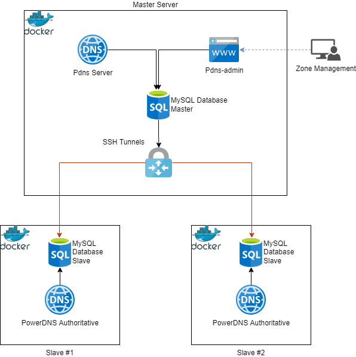

# PowerDNS Docker
Power DNS deployment of a master with PowerDNS Admin and as many slaves as you want.

## Architechture:

### Master Node:

Notes:
* Preferably hidden on private addresses as management ports / services will be exposed on this service.

#### Services:
* MySQL:
  * volume exposed to allow for backups, this server maintains state for the entire system.
  * Exposed ports: 3306:3306 (TCP)
* PowerDNS Authoritative:
  * This is not actively used for queries to the outside world, is primarily used for management of the overall service.
  * Exposed ports: TBD
* PowerDNS-Admin:
  * Web interface to manually manage the zones.
  * Connects to the PowerDNS Authoritative 
  * Exposed ports: 9191:80 (TCP)

### Slave Nodes:
Notes:
* Public servers - The IPs these servers hold will be 

#### Services:
* MySQL:
  * Slaves off of the above master MySQL instance (only needs to sync the PowerDNS schema). This fetches updates from the master service and the PowerDNS service updates accordingly.
  * Exposed ports: None
  * image: mysql/mysql-server:8.0
* PowerDNS Authoritative:
  * Connects to its local MySQL instance for config and data.
  * Exposed ports: 53:53 (TCP+UDP)
  * image: powerdns/pdns-auth-45:4.5.1
